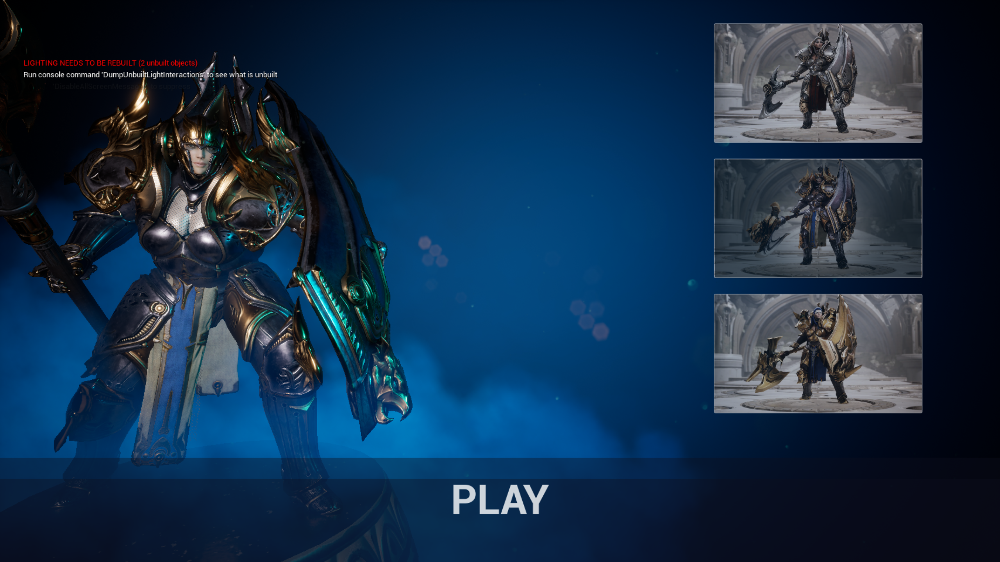
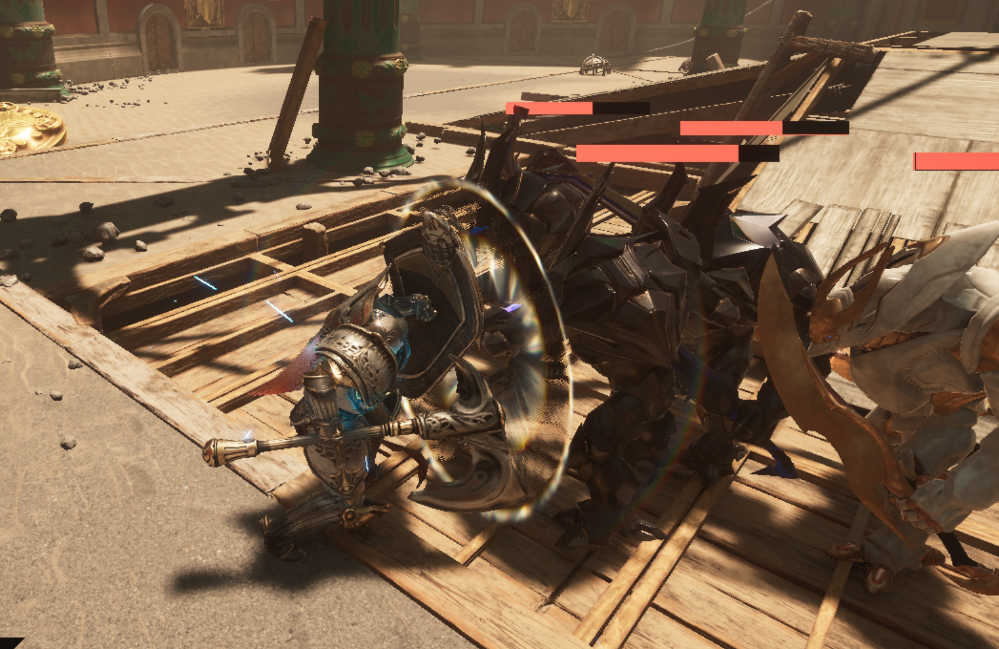
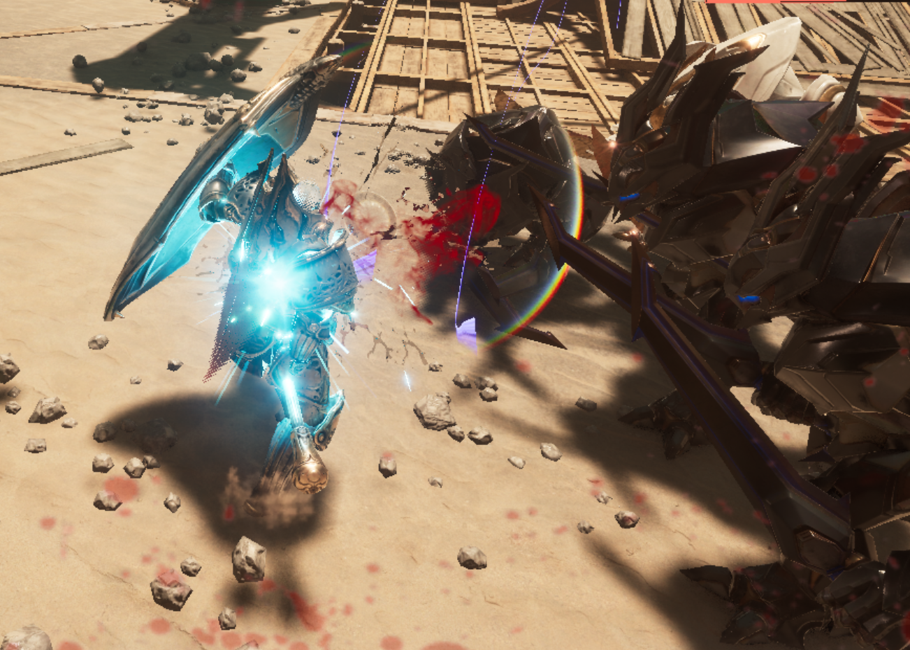
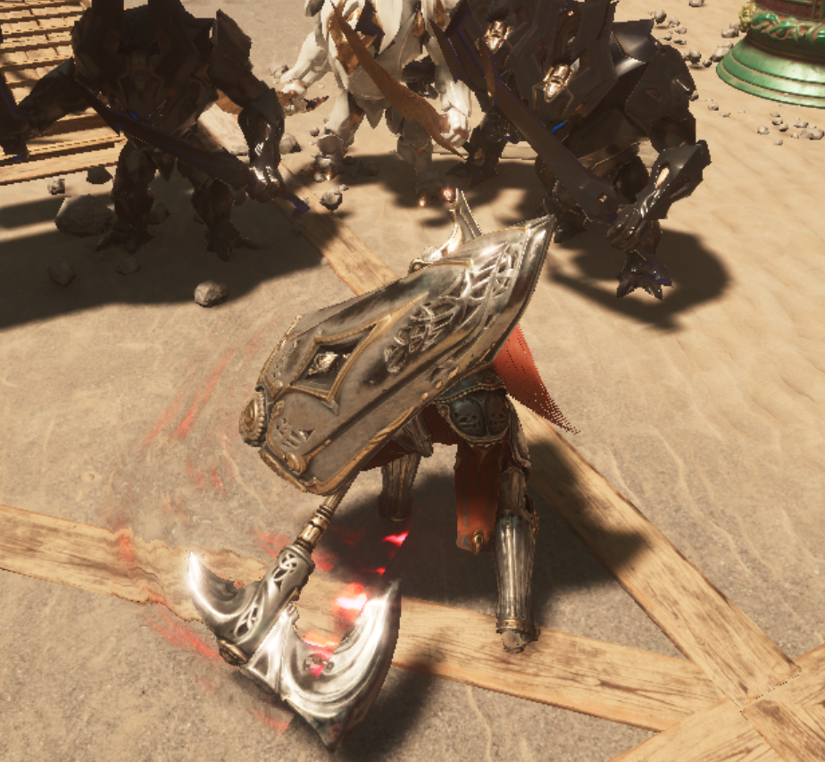
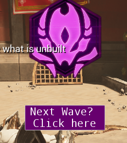
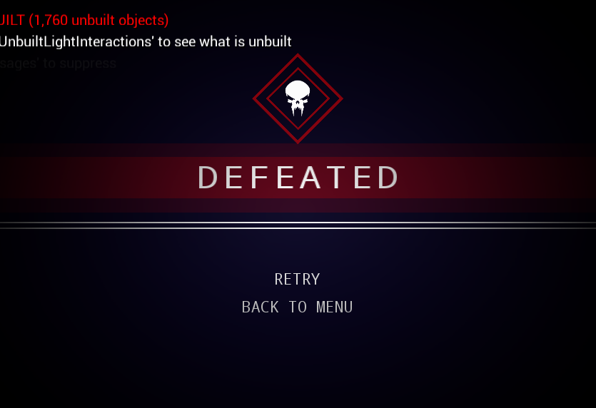
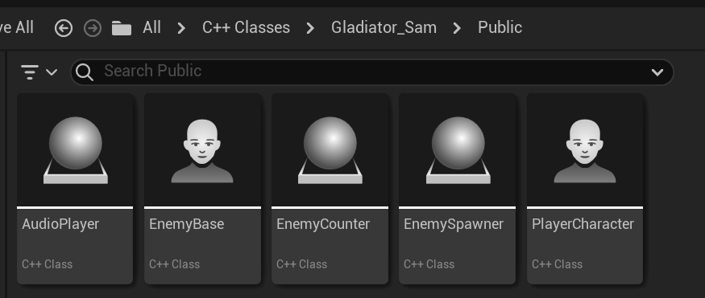

# Gladiator
Gladiator

## Project Overview
### Engine Used: Unreal Engine 5.2

## Introduction
Welcome to Gladiator, an action-packed game where players engage in intense battles with monsters within a gladiatorial arena. The game provides players with basic movement controls, combat key bindings, injury feedback, and victory effects.

Enemies are controlled by AiController and behavior trees, exhibiting autonomous attack functionality and simple retreat behavior.

The project incorporates the Niagara effects system, generating visual effects during player and enemy attacks. A basic music system enhances the gaming experience, with distinct sound effects for player injuries, successful defenses, and triumphant cheers upon defeating enemies.
|  |  |  |
|---|---|---|

A menu interface is designed, allowing players to choose their preferred appearance before entering the game.

In-game features include an enemy spawner and a counter, providing players with the option to continue challenging themselves by generating more powerful enemies after eliminating those present in the arena.
|  |
|---|

Restart by death menu

## Technical Details
Leveraged Unreal's new Niagara effects system.
Implemented player inverse kinematics (IK) binding.
Enemy behavior is controlled through behavior trees.
Utilized C++ code for certain functionalities.

Defined classes such as EnemyBase and Player, along with other functional actors.

## Features
Player Controls: Basic movement and combat controls.
Enemy AI: Autonomous attack and simple retreat behaviors.
Visual Effects: Utilizes the Niagara effects system for impactful visuals during combat.
Music System: Enhances player experience with dynamic sound effects.
Menu Interface: Allows players to choose their preferred appearance.
Enemy Spawner: Continues the challenge by generating more enemies after defeating the current ones.
